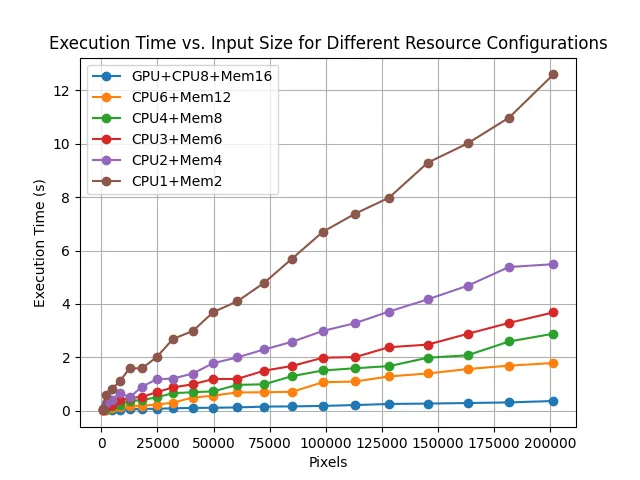

# AI Services Container Runtime Profiling Dataset
> Reproducible measurements of the invocation latency of AI Services Docker Containers, including cold starts and runtime behavior, under various resource specifications and input scales.

[](LICENSE) [](#continuous-integration) [](#requirements) [](https://github.com/<ORG_OR_USER>/<REPO>/issues)

## Overview
This repository provides 
1. A dataset of latency measurements for popular AI service containers (with deep models at the core)
2. Scripts for systematically profiling containerized ML workloads. 
We focus on two critical aspects for scheduling and resource management: container cold start and nonlinear runtime behavior under varid CPU, GPU, and memory specs as well as input sizes. The dataset is designed to support reproducible performance modeling and quantitative evaluation of scheduling and resource allocation strategies.

## What’s Included
- **Static metrics**: container image size, model weights size (download volume).
- **Dynamic metrics**: cold-start latency (image download + container startup), end-to-end runtime under a matrix of resource limits and input scales.
- **Optional metrics**: peak CPU usage, peak GPU utilization or VRAM usage.
- **Scripts**: Docker build/run recipes with resource caps, client scripts for warm-up and request timing, CSV logging, and plotting utilities.

## Measurement Environment
- OS: Ubuntu 24.04.6 LTS  
- Container runtime: Docker 27.5.1  
- Drivers/Libraries: CUDA 12.1, cuDNN 9.1  
- Language/Framework: Python 3.12, PyTorch 2.5.1+cu121

## Data Sources
This dataset is collected with reference to the **APIBench** dataset methodology. External model APIs are sourced from three popular ML model repositories:
- **TorchHub**: https://pytorch.org/hub/
- **TensorFlow Hub**: https://www.tensorflow.org/hub
- **HuggingFace Models**: https://huggingface.co/models

## Resource and Input Matrix
- CPU cores: `{1, 2, 4, 8}`  
- Memory limits: `{2 GB, 4 GB, 8 GB, 16 GB}`  
- GPU count: `{0, 1}`  
- Input scaling: task-specific multi-level inputs (e.g., image resolution or text length grid)

## Data Example


# Guideline for Customized Profiling

## Requirements
- Python 3.9 or newer
- Git and a recent C or C++ toolchain if native dependencies are required
- Optional CUDA 12.x for GPU features

## Quick Start

```bash
# 1) Build an example TorchHub model server image (edit Dockerfile/tag to your setup)
DOCKER_BUILDKIT=0 docker build --network=host -t torchhub_fcn_resnet50_server ./docker

# 2) Launch containers under different resource limits (examples)
docker run --gpus all -d -p 9001:8006 --cpus="8.0" --memory="16g" --name fcn50_gpu  torchhub_fcn_resnet50_server
docker run -d           -p 9002:8006 --cpus="4.0" --memory="8g"  --name fcn50_cpu4 torchhub_fcn_resnet50_server
docker run -d           -p 9003:8006 --cpus="2.0" --memory="4g"  --name fcn50_cpu2 torchhub_fcn_resnet50_server

# 3) Run a client sweep and save measurements to CSV
python scripts/client_sweep.py \
  --url http://127.0.0.1:8006/infer \
  --image examples/sample.jpg \
  --scales 0.1 0.2 0.4 0.6 0.8 1.0 1.25 1.5 1.75 2.0 \
  --out data/raw/fcn50_latency.csv
```

## What to Record
- Startup metrics: image download size and time, container initialization time, first request latency after cold start.
- Runtime metrics: per-request end-to-end latency under each CPU/MEM/GPU/input configuration.
- Optional peaks: peak CPU usage, peak GPU utilization/VRAM.


## Minimal Client Template
```bash
# scripts/client_sweep.py
import time, csv, argparse, requests, numpy as np
from PIL import Image
from torchvision import transforms

def preprocess_image(img, size):
    tfm = transforms.Compose([
        transforms.Resize(size),
        transforms.ToTensor(),
        transforms.Normalize(mean=[0.485,0.456,0.406], std=[0.229,0.224,0.225]),
    ])
    return tfm(img).unsqueeze(0).numpy().tolist()

def send_request(url, tensor, size):
    t0 = time.perf_counter()
    r = requests.post(url, json={"tensor": tensor, "orig_size": [size[1], size[0]]}, timeout=60)
    return time.perf_counter() - t0, r.status_code

def main():
    ap = argparse.ArgumentParser()
    ap.add_argument("--url", required=True)
    ap.add_argument("--image", required=True)
    ap.add_argument("--scales", nargs="+", type=float, required=True)
    ap.add_argument("--base_w", type=int, default=1920)
    ap.add_argument("--base_h", type=int, default=1080)
    ap.add_argument("--out", required=True)
    args = ap.parse_args()

    img = Image.open(args.image).convert("RGB")
    with open(args.out, "w", newline="") as f:
        w = csv.writer(f)
        w.writerow(["scale","width","height","latency_s","status"])
        for s in args.scales:
            size = (int(args.base_w*s), int(args.base_h*s))
            tensor = preprocess_image(img, size)
            lat, code = send_request(args.url, tensor, size)
            w.writerow([s, size[0], size[1], lat, code])

if __name__ == "__main__":
    main()
```


## Modeling Guidance
- After collecting measurements for a container, fit a simple parametric or piecewise model (e.g., least squares) for latency as a function of resources and input size, and report goodness of fit and residuals. Keep train/test splits separate for each container–task pair.


## Contributing
Contributions are welcome. Please open an issue to discuss your idea before submitting a pull request. Follow the code style and ensure tests pass. See `CONTRIBUTING.md` and `CODE_OF_CONDUCT.md` if present.

## License
This project is released under the MIT license. See [LICENSE](LICENSE) for details.

## Acknowledgements
This dataset is part of the DOR project (https://github.com/wingter562/DISTINT_open_data) by Dr. Wentai Wu, Jinan University, with primary contribution by Dr. Shenghai Li, South China University of Technology.

List of all contributors:
- Wentai Wu, JNU
- Shenghai Li, SCUT
- Kaizhe Song, JNU
- Qinan Wu, JNU

Project contact: wentaiwu[at]jnu[dot]edu[dot]cn | lishenghai2022[at]foxmail[dot]com

Issues and feature requests: please open a GitHub Issue
